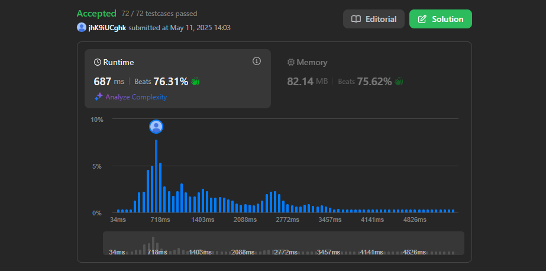
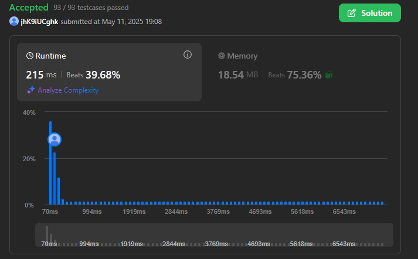

# Grafos 2 -> leetcode

**Número da Lista**: 2<br>
**Conteúdo da Disciplina**: Grafos<br>

## Alunos
|Matrícula | Aluno |
| -- | -- |
| 211041240  |  Manoel Felipe Teixeira Neto |
| 222024283  |  Caio Mesquita Vieira |

## Sobre

## Screenshots





## Vídeo da entrega

## Funcionamento


### ✅ Pré-requisitos

Para rodar os arquivos, você precisa:

- **Python 3 instalado**
  - Verifique digitando no terminal:
    ```bash
    python --version
    ```
    ou
    ```bash
    python3 --version
    ```

- **Um terminal** ou **IDE/editor de código** como:
  - Visual Studio Code
  - IDLE
  - PyCharm
  - Ou simplesmente o terminal + bloco de notas

---

### 🚀 Como rodar o Exercício
#### 1. Acesse a pasta onde o arquivo está salvo:

No terminal:

```bash
cd caminho/para/sua/pasta
```

#### 2. Execute o Script:

```bash
 python menor_ciclo.py
```
ou
```bash
python3 menor_ciclo.py

```
